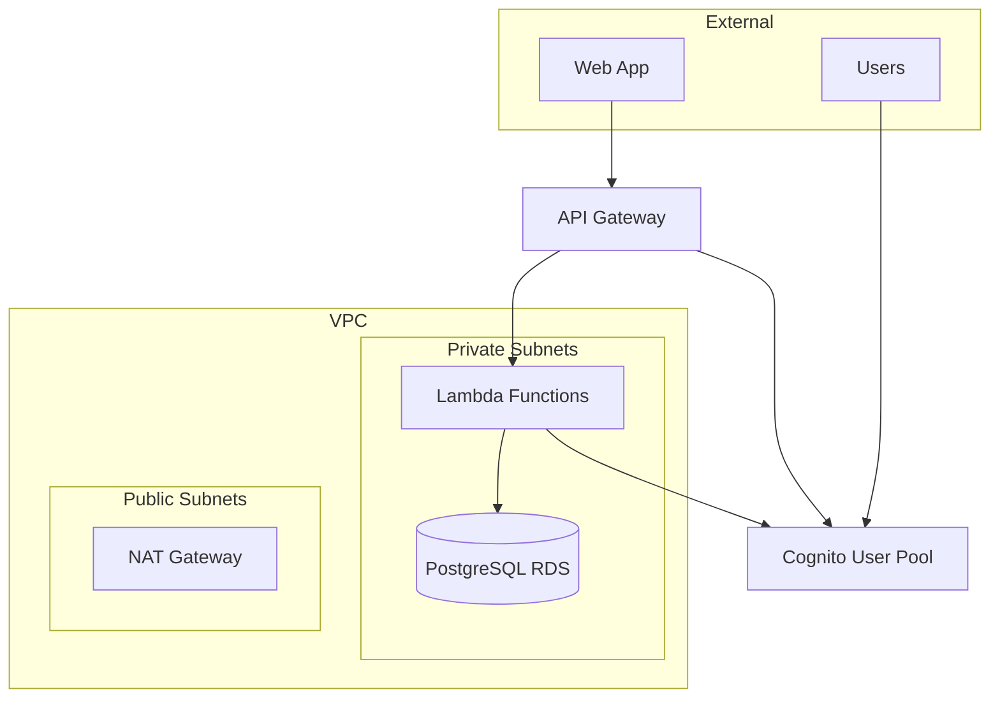

# Community Content Tracker - Infrastructure

This directory contains the AWS CDK infrastructure code for the Community Content Tracker application, implementing Sprint 2: Authentication & Data Layer requirements.

## Architecture Overview

The infrastructure consists of three main stacks deployed in dependency order:

1. **DatabaseStack** - PostgreSQL RDS instance with VPC
2. **CognitoStack** - User authentication with pre-signup Lambda trigger  
3. **ApiGatewayStack** - REST API with JWT authorization



## Project Structure

```
src/infrastructure/
├── bin/
│   └── infrastructure.ts          # CDK app entry point
├── lib/
│   ├── cognito-stack.ts           # Cognito User Pool & Lambda triggers
│   ├── database-stack.ts          # RDS PostgreSQL with VPC
│   ├── api-gateway-stack.ts       # REST API with JWT auth
│   └── iam-stack.ts               # IAM roles and policies
├── config/
│   └── environments.ts            # Environment-specific configuration
├── scripts/
│   └── deploy.sh                  # Deployment automation script
└── README.md                      # This file
```

## Quick Start

### Prerequisites

1. **AWS CLI** configured with appropriate credentials
2. **Node.js** 18+ and npm
3. **AWS CDK** v2 installed globally: `npm install -g aws-cdk`

### Deployment

1. **Install dependencies:**
   ```bash
   cd src/infrastructure
   npm install
   ```

2. **Deploy to development:**
   ```bash
   ./scripts/deploy.sh deploy dev
   ```

3. **Check deployment status:**
   ```bash
   ./scripts/deploy.sh status dev
   ```

## Environments

### Development (`dev`)
- Minimal resources for cost optimization
- Relaxed security policies for easier testing
- Single AZ deployment
- 7-day log retention

### Staging (`staging`)
- Production-like configuration
- Enhanced security policies
- Single AZ with performance insights
- 14-day log retention

### Production (`prod`)
- Multi-AZ deployment with read replica
- Strict security and deletion protection
- Advanced security features enabled
- 30-day log retention
- WAF protection

## Stack Details

### DatabaseStack

**Resources Created:**
- VPC with public/private subnets
- PostgreSQL 15.7 RDS instance
- Database parameter group with optimizations
- Security groups with least privilege access
- Secrets Manager for database credentials

**Environment Configurations:**
| Environment | Instance Type | Storage | Multi-AZ | Backup Retention |
|-------------|---------------|---------|----------|------------------|
| dev         | t3.micro      | 20GB    | No       | 1 day            |
| staging     | t3.small      | 20GB    | No       | 7 days           |
| prod        | r6g.large     | 100GB   | Yes      | 30 days          |

### CognitoStack

**Resources Created:**
- User Pool with email sign-in
- Pre-signup Lambda trigger for username validation
- JWT authorizer Lambda function
- User Pool Client with OAuth configuration
- Admin and AWS Employee user groups

**Custom Attributes:**
- `username` - Unique username (validated by pre-signup trigger)
- `default_visibility` - Default content visibility setting
- `is_admin` - Admin flag for elevated permissions
- `is_aws_employee` - AWS employee flag for special privileges

**Password Policy:**
- Minimum 12 characters (8 for dev)
- Requires uppercase, lowercase, numbers, symbols
- Temporary password valid for 3 days (7 for dev)

### ApiGatewayStack

**Resources Created:**
- REST API with regional endpoint
- JWT authorizer integration
- CORS configuration
- CloudWatch logging
- WAF protection (production only)
- Throttling and caching

**API Structure:**
```
/health                    # Health check (no auth)
/v1/
  /auth/
    /login                 # Authentication endpoints
    /signup
    /refresh
    /logout
    /verify
  /users/                  # User management (JWT required)
    /me
    /{userId}
  /content/                # Content management (JWT required)
    /{contentId}
  /search/                 # Search endpoints (JWT required)
  /admin/                  # Admin endpoints (JWT + admin role)
    /users/
    /content/
```

## Security Features

### Authentication & Authorization
- Cognito User Pool with MFA support
- JWT-based API authorization
- Role-based access control (RBAC)
- Pre-signup validation and sanitization

### Network Security
- VPC with private subnets for database
- Security groups with minimal required access
- VPC Flow Logs (staging/prod)
- WAF protection for API Gateway (prod)

### Data Protection
- Encryption at rest for RDS and Secrets Manager
- Encryption in transit (TLS 1.3)
- Database credentials stored in Secrets Manager
- Parameter Store for configuration management

### IAM Roles & Policies
- Least privilege access principles
- Service-specific roles for Lambda functions
- Cognito identity roles for authenticated users
- Admin roles with elevated permissions

## Deployment Commands

### Basic Operations
```bash
# Deploy to development
./scripts/deploy.sh deploy dev

# Deploy to staging
./scripts/deploy.sh deploy staging

# Deploy to production (with confirmation)
./scripts/deploy.sh deploy prod

# Show differences before deployment
./scripts/deploy.sh diff staging

# Check deployment status
./scripts/deploy.sh status prod
```

### Advanced Options
```bash
# Deploy all stacks simultaneously (faster)
./scripts/deploy.sh deploy dev --all

# Synthesize CloudFormation templates only
./scripts/deploy.sh synth prod

# Destroy environment (with confirmation)
./scripts/deploy.sh destroy dev
```

### Manual CDK Commands
```bash
# List all stacks
cdk list --context environment=dev

# Deploy specific stack
cdk deploy CommunityTracker-Database-dev --context environment=dev

# View generated CloudFormation
cdk synth --context environment=prod
```

## Monitoring & Observability

### CloudWatch Logs
- API Gateway access logs with structured JSON
- Lambda function logs with correlation IDs
- Database logs for performance monitoring
- Configurable retention periods by environment

### X-Ray Tracing
- End-to-end request tracing enabled
- Lambda function instrumentation
- Performance insights for database queries

### Metrics & Alarms
- API Gateway request metrics
- Lambda execution metrics
- RDS performance metrics
- Custom application metrics

## Cost Optimization

### Development Environment
- t3.micro RDS instance (~$13/month)
- Minimal Lambda reserved concurrency
- Short log retention periods
- No read replicas or Multi-AZ

### Production Environment
- Right-sized instances based on actual usage
- Read replicas for query optimization
- Reserved instances for predictable workloads
- Cost allocation tags for tracking

## Configuration Management

### Environment Variables
Configuration is managed through:
1. `config/environments.ts` - Typed configuration objects
2. AWS Parameter Store - Runtime configuration
3. Secrets Manager - Sensitive values
4. CDK context - Deployment-time values

### Parameter Store Hierarchy
```
/${environment}/community-tracker/
  ├── database/
  │   ├── url              # Database connection string
  │   ├── endpoint         # Database endpoint
  │   └── port             # Database port
  ├── cognito/
  │   ├── user-pool-id     # Cognito User Pool ID
  │   └── client-id        # Cognito Client ID
  └── api/
      ├── url              # API Gateway URL
      └── id               # API Gateway ID
```

## Troubleshooting

### Common Issues

**1. CDK Bootstrap Required**
```bash
Error: Need to perform AWS CDK bootstrap
Solution: cdk bootstrap
```

**2. Stack Dependencies**
```bash
Error: Stack depends on another stack
Solution: Deploy stacks in correct order or use --all flag
```

**3. Resource Conflicts**
```bash
Error: Resource already exists
Solution: Check for existing resources or use different environment
```

**4. Permission Errors**
```bash
Error: User not authorized to perform action
Solution: Ensure AWS credentials have necessary permissions
```

### Debugging Tips

1. **Enable Debug Logging:**
   ```bash
   export CDK_DEBUG=true
   cdk deploy --context environment=dev
   ```

2. **Check CloudFormation Console:**
   - View stack events and error messages
   - Check resource creation status

3. **Validate Configuration:**
   ```bash
   npm run typecheck
   cdk synth --context environment=dev
   ```

## Scaling Considerations

### Database Scaling
- Vertical scaling through instance size increases
- Read replicas for read-heavy workloads
- Connection pooling for high concurrency
- Query optimization and indexing

### API Scaling
- Auto-scaling based on request volume
- CloudFront CDN for static content
- API Gateway caching for frequently accessed data
- Lambda reserved concurrency tuning

### Security Scaling
- WAF rule tuning based on traffic patterns
- Rate limiting adjustments
- DDoS protection with AWS Shield
- Security monitoring and alerting

## CI/CD Integration

The infrastructure supports automated deployments through:

1. **GitHub Actions** (recommended)
2. **AWS CodePipeline**
3. **Jenkins** or other CI/CD tools

Example GitHub Actions workflow:
```yaml
name: Deploy Infrastructure
on:
  push:
    branches: [main, staging, develop]
    paths: [src/infrastructure/**]

jobs:
  deploy:
    runs-on: ubuntu-latest
    steps:
      - uses: actions/checkout@v3
      - uses: actions/setup-node@v3
      - name: Deploy
        run: |
          cd src/infrastructure
          npm ci
          ./scripts/deploy.sh deploy ${{ env.ENVIRONMENT }}
```

## Contributing

1. Make changes to infrastructure code
2. Test with `npm run typecheck`
3. Deploy to development environment
4. Create pull request with infrastructure changes
5. Deploy to staging for integration testing
6. Deploy to production after approval

---

For questions or issues, please contact the AWS Community Team or create an issue in the repository.