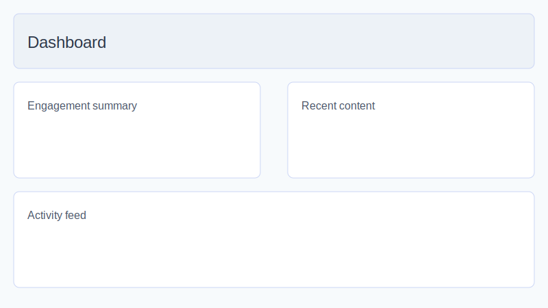
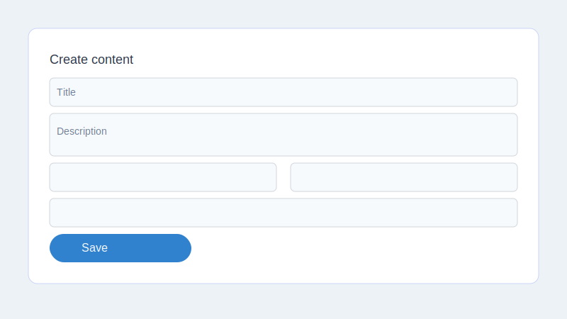
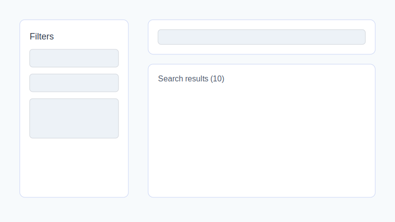
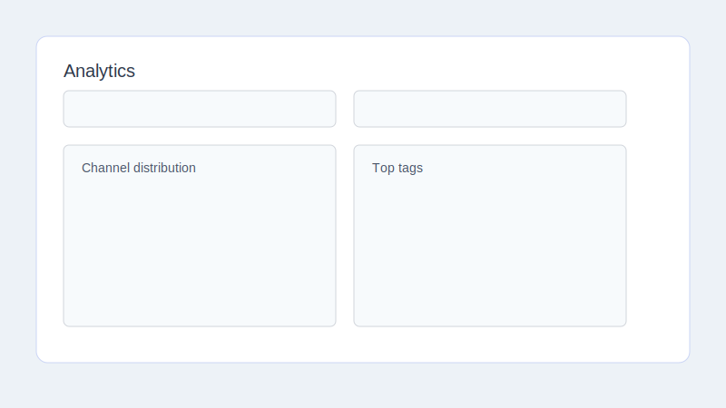

# User Guide – AWS Community Content Hub

> Version 1.0 · Updated for Sprint 8

## 1. Getting started
1. Navigate to `https://app.awscommunityhub.org`.
2. Click **Register** and complete the Cognito sign-up form.
3. Confirm your email using the verification code.
4. Log in and you will land on the dashboard.

## 2. Managing your profile
- Open **Settings → Profile** to update username, bio, and visibility defaults.
- Social links accept full URLs and are validated client-side.
- Use the **Preview** card to verify profile before saving.

## 3. Content ingestion
- Go to **Dashboard → Content**.
- Click **Add Content** and provide title, URLs, tags, and visibility.
- The platform validates URLs and prevents duplicates.
- Bulk visibility updates can be applied from the content list toolbar.

## 4. Search & discovery
- Use the global search bar or open **Dashboard → Search** for advanced filters.
- Save frequent queries with **Save Search**; they appear in the left history panel.
- Export filtered results via **Export CSV**.

## 5. GDPR self-service
- **Export data:** Settings → Privacy → *Download personal archive*.
- **Delete account:** Settings → Danger Zone → *Delete account* (irreversible).
- Expect an email confirmation for each action. Exports are delivered as downloadable JSON.

## 6. Analytics
- Navigate to **Dashboard → Analytics** for channel and tag breakdowns.
- Adjust date range and grouping (day/week/month) to compare performance.
- Export CSV summaries or program-specific reports for Hero/Ambassador reporting.

## 7. Notifications & consent
- Cookie banner respects analytics consent; update preferences in **Settings → Privacy**.
- Email notifications can be toggled under **Settings → Communication**.

## 8. Support
- Email `support@awscommunityhub.org` for technical issues.
- Join the Community Slack `#content-hub` channel for updates.
- Report bugs via the in-app **Feedback** button (Dashboard footer).
